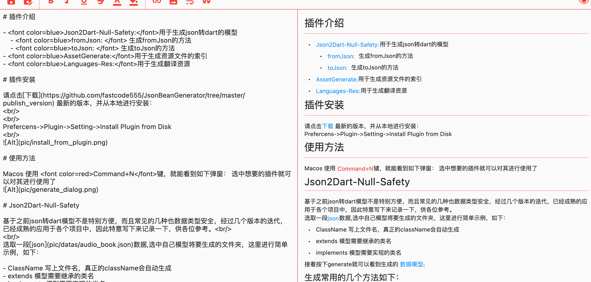

# flutter_md
Flutter Markdown 的编辑器

# 功能描述
- 支持常用的markdown'标签提示
- 支持自动增加一些字符的功能
- 支持文本高亮的功能
- 支持特殊符号
## 1.功能操作栏

## 2.字体颜色选择操作栏
- 1.可以选中文字后，再选择颜色
- 2.直接选择颜色，再填入文字

## 3. 支持特殊的字符，
- ①.支持这些特殊的字符
- ②.如果上一行是符合规格的数字，下一行也会自动递增

## 4.支持众多的html 标签

## 5.支持众多的markdown 语法提示

## 6.支持只看模式
